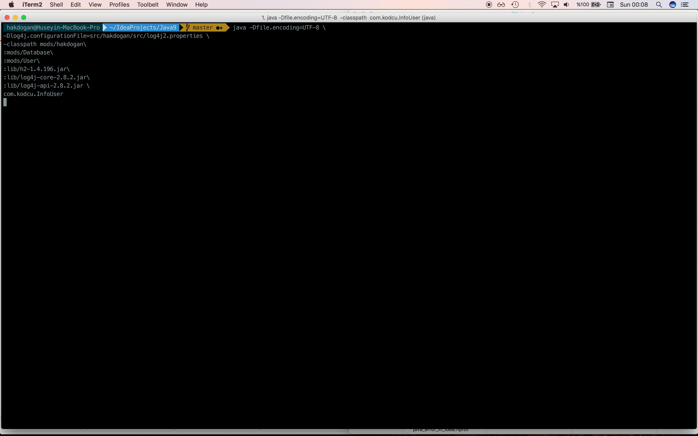

= Example of Java 9 module system non-maven

image:https://travis-ci.org/hakdogan/Java9-module-system-non-maven.svg?branch=master["Build Status", link="https://travis-ci.org/hakdogan/Java9-module-system-non-maven"]

This application simply exemplifies working Module System on Java 9 and it uses some libraries such as ``h2 database`` and ``log4j`` as an example of adding the external library.

== How do I compile?

You should use the ``javac`` command with the following parameters in the root directory of the project to compile the classes.

[source,]
----
javac --module-path mods:lib \
-d mods --module-source-path src \
src/Database/module-info.java \
src/Database/src/com/kodcu/db/ConnDB.java \
src/hakdogan/module-info.java \
src/hakdogan/src/com/kodcu/InfoUser.java \
src/User/module-info.java \
src/User/src/com/kodcu/user/User.java
----

With ``find``, this command can be written shorter.

[source,]
----
javac --module-path mods:lib \
-d mods --module-source-path \
src $(find . -name "*.java")
----

== How do I run?

You should use the ``java`` command with the following parameters in the root directory of the project to run this code.
[source,]
----
java -Dfile.encoding=UTF-8 \
-Dlog4j.configurationFile=src/hakdogan/src/log4j2.properties \
-classpath mods/hakdogan\
:mods/Database\
:mods/User\
:lib/h2-1.4.196.jar\
:lib/log4j-core-2.8.2.jar\
:lib/log4j-api-2.8.2.jar \
com.kodcu.InfoUser
----

